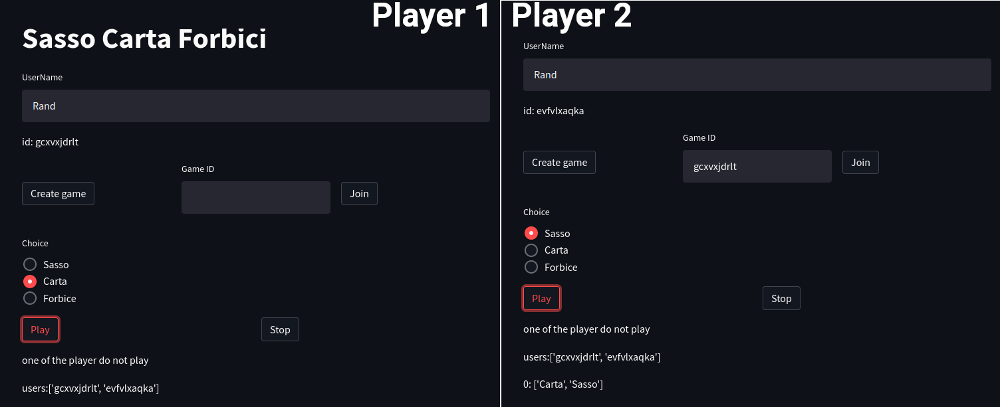

[](https://share.streamlit.io/nicolalandro/hand_tracking_streamlit/main/app.py)

# Morra Cinese
Un repo in cui stavo pensando id creare un sasso carta forbici multi player con streamlit.



```
pip install -r requrements
python -m streamlit run app.py 
```